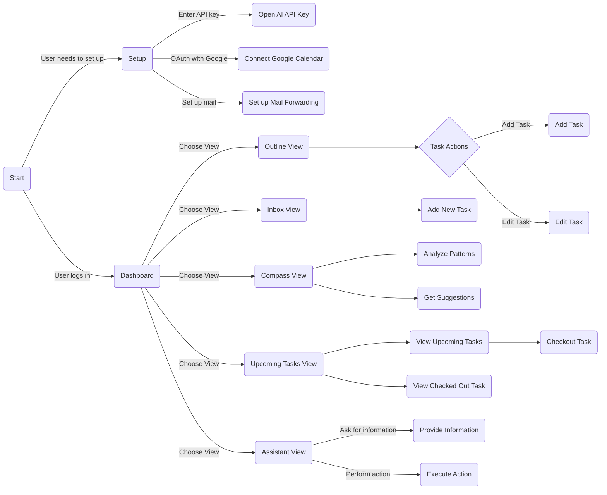

Old Flowchart for Initial Idea:

New Specification:

(Notes)

I should be able to add tasks (with perhaps an assistant for better estimation)
where each task most importantly has a duration and a do-by date.

I want to add tasks I know are recurring like assignments, perhaps with not
as much specificity at the beginning. Then I will add new tasks as they come 
(like in the GTD system). 

Also, in setting up I should set up how many hours I want to be working per week
and time windows I can work in. The time window is default, but if for a certain
week I feel like I want to work more or less, or maybe some days I can't 
work certain hours, I can change that. 

The prime purpose of the system is to take away the decision fatigue of choosing
when to do tasks. My only responsibility is only to add tasks (maybe with AI assistant 
help so I add all the important information for the system to work well). I am also
to determine what space I have available and the system does the rest.

There should be a great notification system so I can be notified of non-trivial
calendar things, like say when what I have to do exceeds what I have set as my
available time (or when they are very close)

Since I am developing the system for myself, I should also still have access to all 
the knobs and levers in case I want to change somethings to a very specific thing as I 
experiment with the system.

In terms of development, I want this to be on CI/CD, so I can prototype quickly and 
improve as I feel the need until I basically tune the system to perfectly fit my needs.
Traffic and performance should not be an issue, since I am the sole user. 
An interesting functionality down the line would be working together with other 
people for joint tasks. 

Minimum Viable Product I believe interfaces with Google Calendar, coz that's the only
reasonable I actually use it, though I could use a terminal UI for quick testing (tho that could be a pain to implement).

(Spec)

- Version 0.0: Core Task Management
  - Simple CLI interface for basic operations
  - Core features:
    - Add tasks with:
      - Title
      - Duration estimate
      - Due date
    - List all tasks
    - Mark tasks as complete
    - Basic JSON file storage (no database needed yet)
    - Simple weekly time window configuration (e.g., "Monday 9-5, Tuesday 10-6")
    - Basic scheduling algorithm that:
      - Assigns tasks to available time slots
      - Respects due dates
      - Outputs a basic daily schedule

(Notes)
I think it would be cool to have different time window profiles, say one for
school work, another for exercise. This way, I can specify the time windows when
I can do certain things. Another aspect of the profile (tho it is a different
kind of thing) is for like school vs. holidays. So one profile is in the sense
of within a week, i can have different time window profiles and the other is
outside of that, i can have a different work/exercise profile for school vs.
holidays.

(Implementation Details)
The scheduling algorithm is a first-fit algorithm. It sorts the tasks by due date
and then tries to fit each task into the earliest available time slot. It has
error handling for when a task can't be scheduled before its due date.

(Notes)
In the next version, I need to improve on the first-fit algorithm. 
Also, question: how do i resolve conflicts in windows, can the exercise window
have the same time availability as the work window? i think it should. 

In the CLI, when adding tasks, if only a time is given, assume it is for today.
Furthering on this, we will probably need to implement sophisticated parsing for
relative dates and times.

For the assistant to work best, there is going to be a need to understand
task nature and a memory of previous tasks, to build a routine and create
natural schedules that are actually pleasant to work in. Like a great
executive assistant would. So set up in this world would take some time, for 
the system to understand me, and then learn patterns as it's used.

Version 0.1: Google Calendar integration
Version 0.2: Recurring tasks and Improved Task Organization
    - A README.md file (finally)
Version 0.3: Notification system
Version 0.4: AI assistance for task estimation
Version 1.0: More sophisticated scheduling

(Spec)

- Version 0.2: Google Calendar Integration and Better Task Management
  - Task Management Improvements:
    - Edit existing tasks (name, due date)
    - Delete tasks
    - View task history
    - Better date/time input parsing
    - Improved error messages
    - Task completion timestamps
  - Enhanced CLI commands:
    - Editing and deleting tasks
    - Logging/completing tasks
    - Showing detailed task info
    - Showing completed and incomplete tasks
    - Showing today's tasks
    - Showing this week's tasks
    - Force calendar sync
  - Improved Google Calendar Integration:
    - Two-way sync between tasks and calendar
    - Update calendar when tasks are modified
    - Delete calendar events when tasks are deleted
    - Sync task completion status with calendar
    - Better error handling for calendar operations
    - Calendar configuration options:
      - Calendar selection
      - Sync frequency